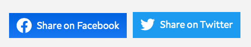

# Better Share Buttons

I created this repository because I want to make it easy to create share buttons for various social media platforms.

Benefits of using this repository are:

- SVG icon are already included.
- Basic CSS styles are already done for you—so the button looks great from the get-go.
- You can easily tweak the buttons further by including your own CSS.

Here's what the buttons look like in action.

## Usage instructions

Right now this repository only supports Facebook and Twitter share buttons.

Usage instructions for each share button are included in their respective folders.

- [Facebook](./facebook/readme.md)
- [Twitter](./twitter/readme.md)

## Contributing to this repository

There are a few steps:

1. Please create an SVG for the icon.
2. Please create a CSS file for the icon.
3. Send in a Pull Request.

Thank you!
